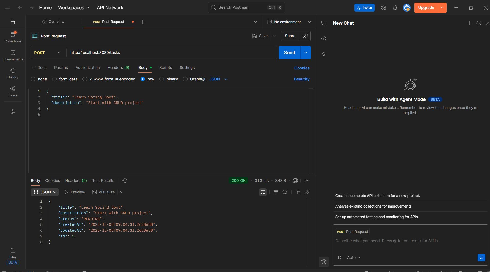
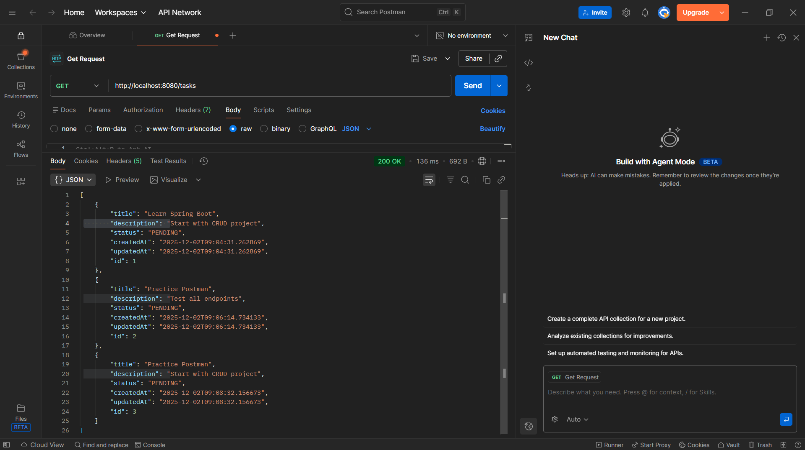
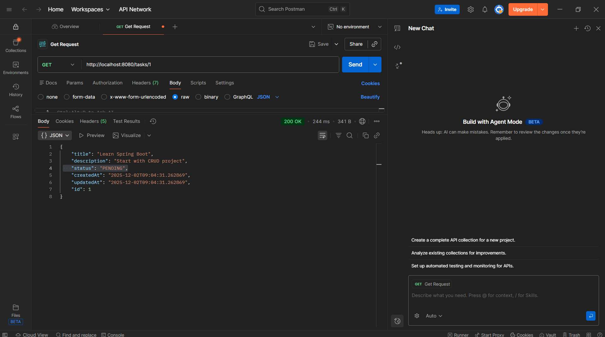
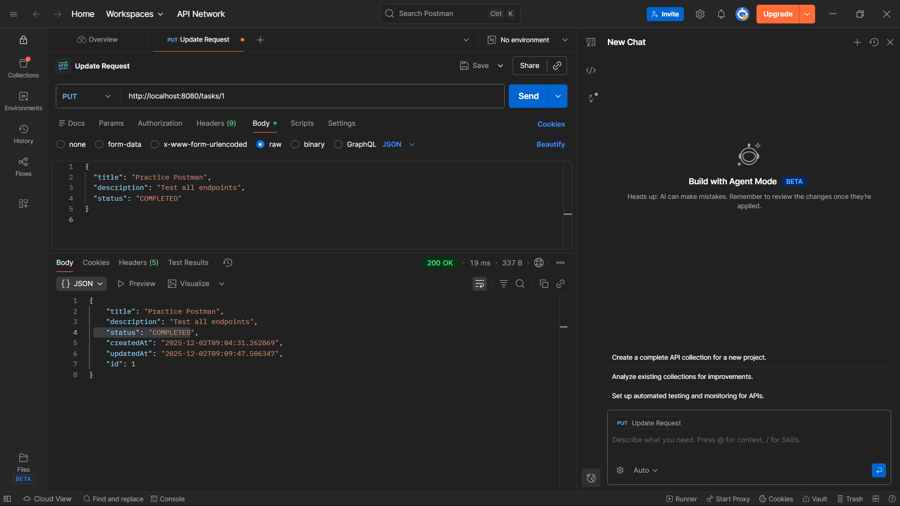

# 📝 Task Manager API

A simple **Task Manager REST API** built using Spring Boot.  
This project demonstrates how to build and test full CRUD features using:

- Spring Boot
- Spring Web
- Spring Data JPA
- H2 In-Memory Database
- Postman

---

## 📌 What This Project Covers

✔ REST API design  
✔ Layered architecture  
✔ CRUD operations  
✔ JSON request handling  
✔ Postman API testing

Architecture used:

```
Client → Controller → Service → Repository → Database
```

---

## 🚀 API Endpoints

| Method  | Endpoint        | Description          |
|---------|-----------------|----------------------|
| `POST`  | `/tasks`        | Create a new task    |
| `GET`   | `/tasks`        | Get all tasks        |
| `GET`   | `/tasks/{id}`   | Get task by ID       |
| `PUT`   | `/tasks/{id}`   | Update a task        |
| `DELETE`| `/tasks/{id}`   | Delete a task        |


---

## 🧪 Postman Testing Screenshots

### 📍 Create Task (POST)


---

### 📍 Get All Tasks (GET)


---

### 📍 Get Task by ID (GET)


---

### 📍 Update Task (PUT)


---

### 📍 Delete Task (DELETE)


---

## ▶️ How to Run This Project

1️⃣ Clone the repository:

```sh
git clone https://github.com/PolakiJayaKrishna/task-manager-api.git
```

2️⃣ Navigate into the project folder:

```sh
cd task-manager-api
```

3️⃣ Run the project using Maven:

```sh
mvn spring-boot:run
```

4️⃣ Application runs at:

```
http://localhost:8080
```

---

## 📂 Entity Structure

```
Task
 ├── id: Long
 ├── title: String
 ├── description: String
 ├── status: PENDING | COMPLETED
 ├── createdAt: LocalDateTime
 └── updatedAt: LocalDateTime
```

---

## ✔ Current Status

| Feature           | Status   |
|------------------|----------|
| Create Task      | ✔ Done   |
| Get All Tasks    | ✔ Done   |
| Get Task by ID   | ✔ Done   |
| Update Task      | ✔ Done   |
| Delete Task      | ✔ Done   |


---

## 🎯 Next Phase (Future Improvements)

🔹 DTOs  
🔹 Validation rules  
🔹 Global exception handling  
🔹 Swagger / OpenAPI documentation  
🔹 MySQL support

---

### ✨ Summary

This is a complete beginner-friendly CRUD project built using Spring Boot following clean architecture and REST principles.  
It serves as a strong foundation for more advanced backend development.

---

🙏 **Thank you for exploring this project.**

