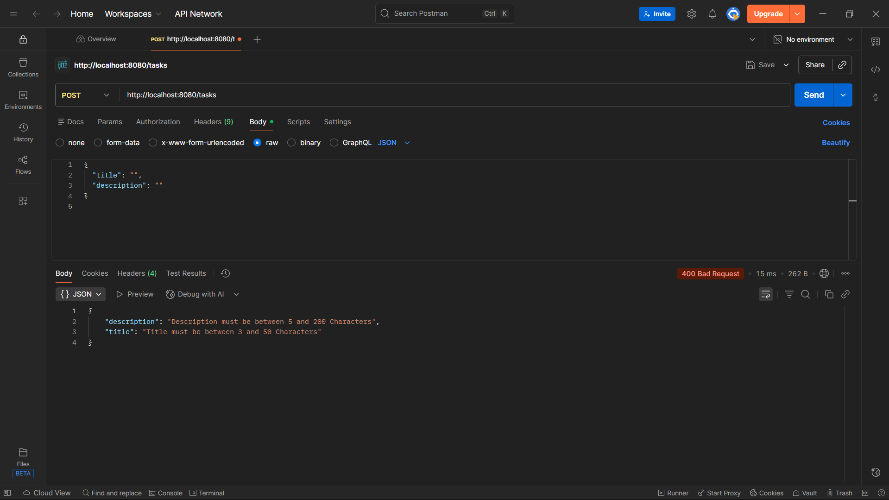
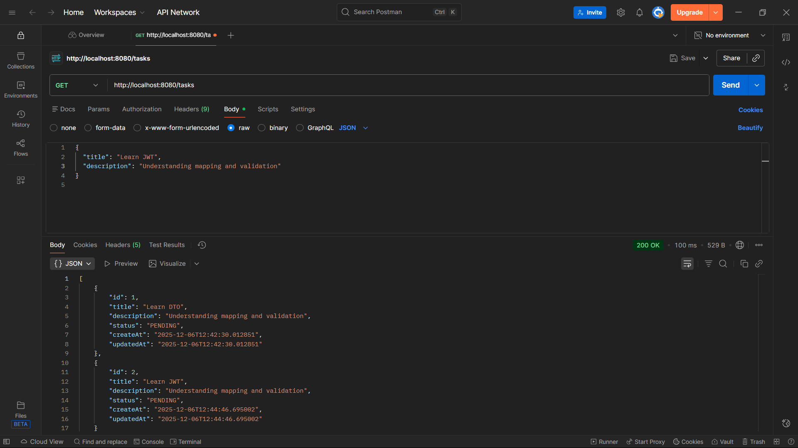
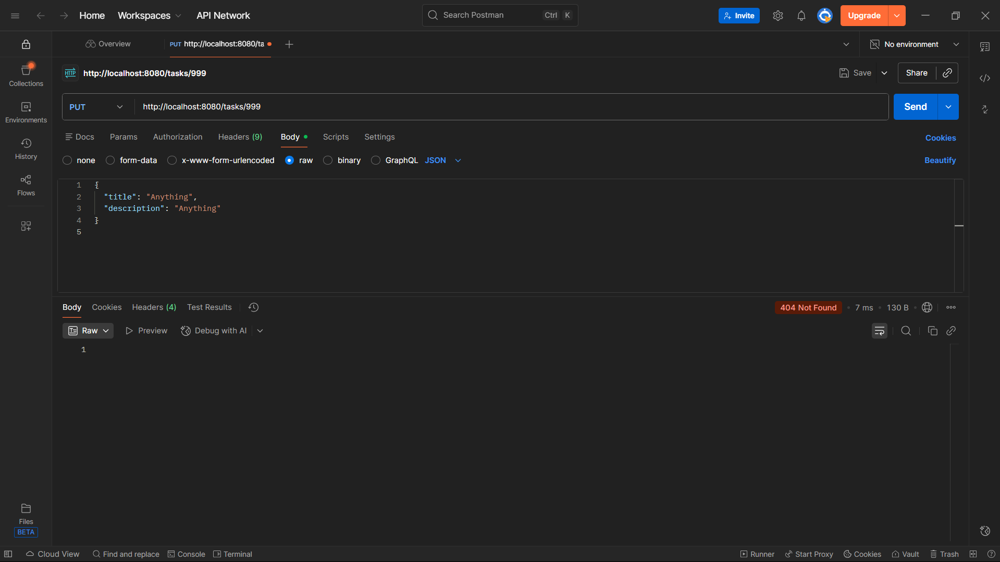
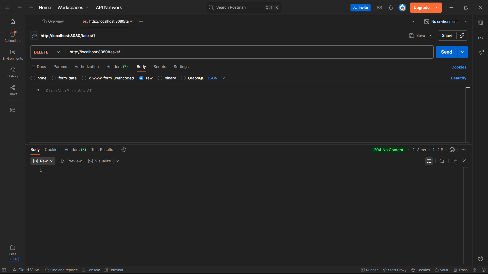
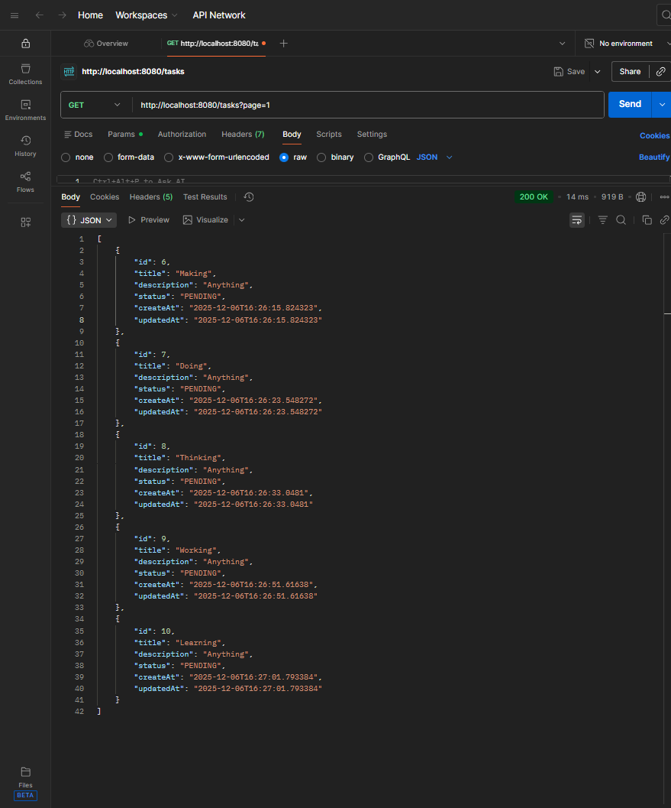
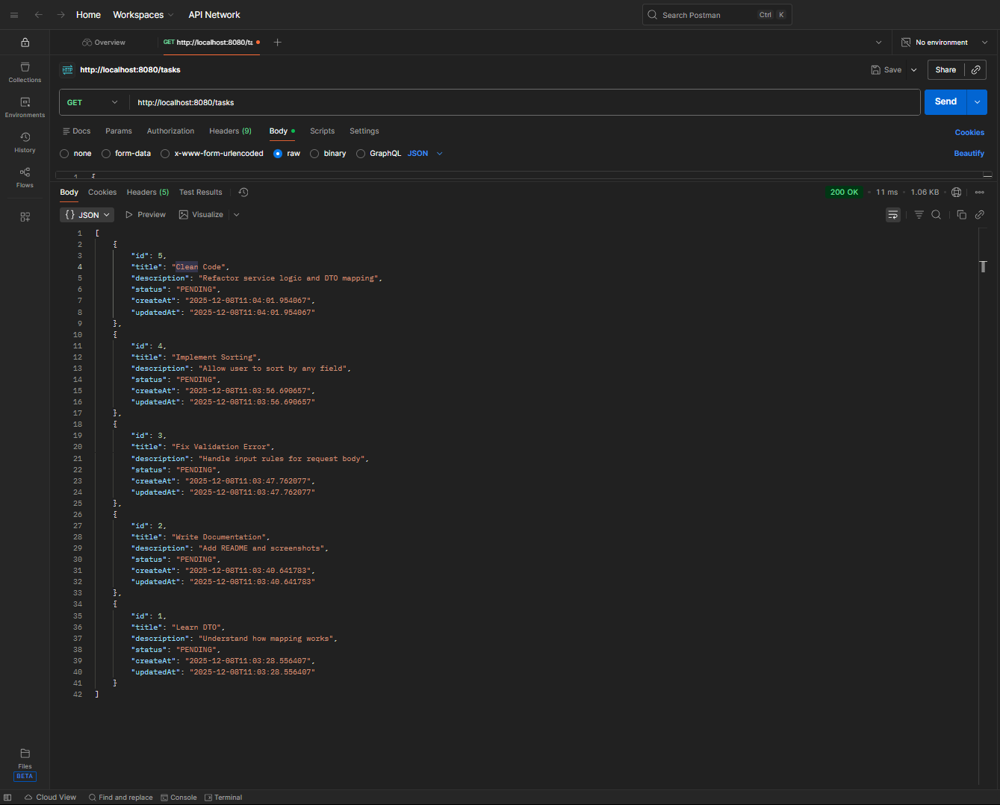

# Task Manager API 📝


A **production-style Spring Boot REST API** demonstrating clean backend architecture, DTO usage, validation, pagination, sorting, and partial updates — built as a **portfolio-ready backend project**.

---

## 🎯 Project Highlights

- Clean REST API design (Controller → Service → Repository)
- Request & Response DTO separation
- Validation with meaningful error messages
- Global exception handling
- Pagination and sorting support
- Enum-based business state handling
- PATCH-based partial update (status only)
- MySQL database integration
- Fully tested using Postman with screenshots

---

## 🧱 Tech Stack

| Technology        | Purpose                  |
|------------------|--------------------------|
| Java 17          | Core language            |
| Spring Boot      | Backend framework        |
| Spring Web       | REST APIs                |
| Spring Data JPA  | Persistence layer        |
| Hibernate        | ORM                      |
| MySQL            | Relational database      |
| Maven            | Build tool               |
| Postman          | API testing              |

---

## 🏗 Architecture

```
Client
  ↓
Controller
  ↓
DTO (Request / Response)
  ↓
Service (Business Logic)
  ↓
Repository (JPA)
  ↓
MySQL Database
```

---

## ✨ Features

- Create, read, update, and delete tasks
- DTO-based request and response models
- Validation with custom messages
- Global exception handling
- Pagination using `page` and `size`
- Sorting using `sortBy` and `direction`
- Enum-based task status (`PENDING`, `COMPLETED`)
- PATCH endpoint for status-only updates

---

## 📦 API Endpoints

| Method | Endpoint                 | Description                     |
|--------|--------------------------|---------------------------------|
| POST   | `/tasks`                 | Create a new task               |
| GET    | `/tasks`                 | Get all tasks (pagination)      |
| GET    | `/tasks/{id}`            | Get task by ID                  |
| PUT    | `/tasks/{id}`            | Update title & description      |
| PATCH  | `/tasks/{id}/status`     | Update task status only         |
| DELETE | `/tasks/{id}`            | Delete task                     |

---

## 📮 Sample Request

### Create Task — POST `/tasks`

```json
{
  "title": "Learn Spring Boot",
  "description": "Build production-ready APIs"
}
```

### Successful Response

```json
{
  "id": 1,
  "title": "Learn Spring Boot",
  "description": "Build production-ready APIs",
  "status": "PENDING",
  "createdAt": "2025-12-12T20:40:20",
  "updatedAt": "2025-12-12T20:40:20"
}
```

---
## 📷 API Demo (Postman Screenshots)

### 1️⃣ Create Task (POST `/tasks`)

**Success**


**Validation Error**


---

### 2️⃣ Get All Tasks (GET `/tasks`)



---

### 3️⃣ Get Task By ID (GET `/tasks/{id}`)

**Success**


**Not Found**


---

### 4️⃣ Update Task (PUT `/tasks/{id}`)

**Success**


**Validation / Not Found Error**


---

### 5️⃣ Delete Task (DELETE `/tasks/{id}`)

**Success**


**Not Found**


---

### 6️⃣ Pagination (GET `/tasks?page=x&size=y`)

**Single Page Result**


**All Pages Metadata**


**Pageable Response**


---

### 7️⃣ Sorting & Pagination Combined

**Sort + Pagination**


**Sort by Title (ASC)**


**Sort by Title (DESC)**


**Get All Tasks With Sorting**


---

### 8️⃣ Partial Update – Status Only (PATCH `/tasks/{id}/status`)

**Status Update Success**

---

## 🧩 Data Model

### Entity: `Task`

| Field       | Type          |
|------------|---------------|
| id         | Long          |
| title      | String        |
| description| String        |
| status     | TaskStatus    |
| createdAt  | LocalDateTime |
| updatedAt  | LocalDateTime |

### Enum: `TaskStatus`

```java
public enum TaskStatus {
    PENDING,
    COMPLETED
}
```

---

## ▶ Run the Application

```bash
mvn spring-boot:run
```

Base URL:
```
http://localhost:8080
```

---

## 🏁 Summary

This project demonstrates:

- Professional Spring Boot REST API design
- Clean layered architecture
- Real database usage (MySQL)
- Pagination, sorting, and partial updates
- Strong debugging and implementation discipline

📄 License: MIT  
🧑‍💻 Built with focus on backend engineering best practices.